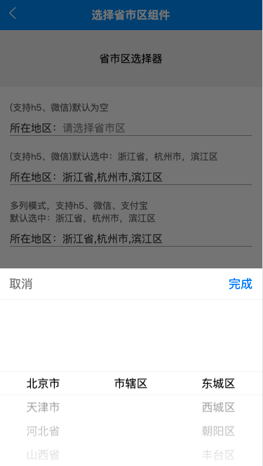

# UA-COMPONNETS

> 记录在uniapp开发过程中，使用到的h5页面组件，方便查看以及以后使用。window电脑可使用`ctrl + 鼠标左击`打开新页面，mac电脑可使用`command +鼠标左击  `打开新页面。开启浏览器`mobile`模式查看。

整个组件的总访问页面，[打开首页](https://j-y-h.github.io/ua-components/dist/build/h5/index.html)

##### 1. 省市区选择组件

[文档](./docs/省市区选择组件.md)

[demo](https://j-y-h.github.io/ua-components/dist/build/h5/index.html#/pages/region/region)

页面样式概览：

